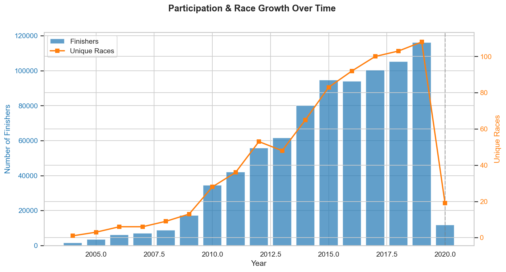
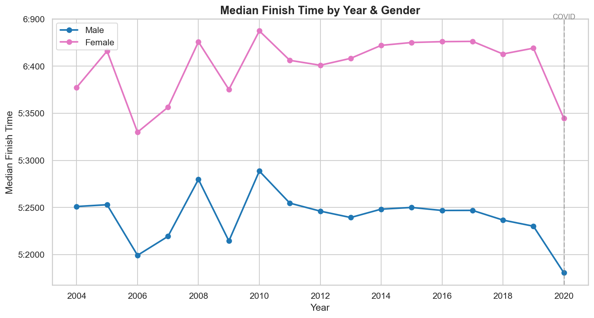

# 🏊‍♂️🚴‍♀️🏃 IRONMAN 70.3 Analysis

An in-depth analysis of **840,000+ IRONMAN 70.3 race results** spanning 195 events across 240 countries from 2004 to 2020.

🌐 **[View the interactive analysis →](https://ambitious-grass-0032c1b10.7.azurestaticapps.net/)**

---

## 📊 Key Findings

| Metric | Value |
|---|---|
| Total finishers analysed | 840,057 |
| Year range | 2004–2020 |
| Unique races | 195 |
| Countries represented | 240 |
| Overall median finish | 5h 47m |
| Male median finish | 5h 40m |
| Female median finish | 6h 09m |
| Fastest recorded finish | 3h 36m |

- **Performance is remarkably stable** — median finish times barely changed from 2004 to 2019 despite participation growing from under 1,000 to over 116,000 finishers per year
- **Peak performance age** is late 20s to early 30s, but athletes in their mid-40s are typically only 15–20 minutes slower
- **The bike leg is king** — accounting for ~50% of total race time, it's the biggest lever for improving overall finish time
- **Course selection matters** — the gap between the fastest and slowest courses exceeds 1 hour
- **The USA dominates** participation with 332K finishers (5.5× more than #2 Australia), but European nations lead on speed
- **COVID-19 impact** — 2020 saw a ~90% drop to just 11,800 finishers

## 📈 Analysis Sections

1. **Performance Trends Over Time** — participation growth, median finish times, split trends, and field spread
2. **Age Group Analysis** — finish times by age, participation demographics, peak performance age, and discipline split by age
3. **Country Comparisons** — top countries by participation and speed, national strengths by discipline
4. **Race & Course Comparisons** — largest races, fastest and slowest courses

## 🖼️ Sample Visualisations

<p align="center">
  
  <br><em>From under 1,000 finishers to over 116,000 — explosive growth driven by new events worldwide</em>
</p>

<p align="center">
  
  <br><em>Median finish times remained stable despite the sport's massive growth</em>
</p>

## 🗂️ Project Structure

```
├── index.html                      # Static analysis webpage
├── ironman_70_3_analysis.ipynb     # Jupyter notebook with full analysis
├── analysis.py                     # Python analysis script
├── Half_Ironman_df6.csv            # Race results dataset (840K rows)
├── analysis_output/                # Generated charts and summary stats
│   ├── 01–19 *.png                 # Visualisation charts
│   └── summary_statistics.csv      # Key metrics
└── ironman-results/                # Raw results data
```

## 🛠️ Tech Stack

- **Python** — pandas, matplotlib, seaborn, numpy
- **Jupyter Notebook** — exploratory analysis
- **Azure Static Web Apps** — hosting the analysis page
- **GitHub Actions** — CI/CD auto-deploy on push

## 🚀 Running Locally

```bash
# Clone the repo
git clone https://github.com/amynic/ironman.git
cd ironman

# Create a virtual environment and install dependencies
python -m venv .venv
.venv\Scripts\activate        # Windows
pip install pandas matplotlib seaborn numpy jupyter

# Launch the notebook
jupyter notebook ironman_70_3_analysis.ipynb

# Or just open index.html in a browser for the static analysis
```

## 📄 License

This project is for educational and personal analysis purposes.

---

*Built with 🏅 by [amynic](https://github.com/amynic)*
